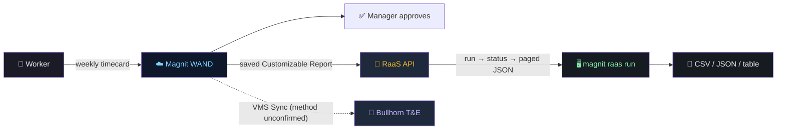
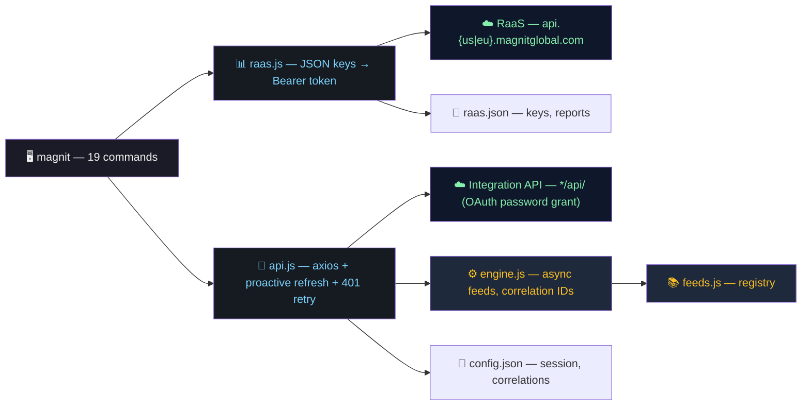

# magnit-cli

```text
                               "      m                  ""#      "
mmmmm   mmm    mmmm  m mm   mmm    mm#mm          mmm     #    mmm
# # #  "   #  #" "#  #"  #    #      #           #"  "    #      #
# # #  m"""#  #   #  #   #    #      #     """   #        #      #
# # #  "mm"#  "#m"#  #   #  mm#mm    "mm         "#mm"    "mm  mm#mm
               m  #
                ""
```
<div align="center">
<!-- Badges -->


[](https://nodejs.org/)
[](LICENSE)
[](#command-cheat-sheet)
[](#api-coverage)
[](#timecards-how-to-get-them)

**Pull Magnit (WAND) timecards from your terminal, plus a client for the async Integration API feeds.**

### At a Glance

| 🔐 Keys | 🔖 Save report | ⏱ Pull timecards | 📄 Export | 🔎 Check a run |
|---|---|---|---|---|
| `raas login` | `raas report add` | `raas run timecards --all` | `-o csv --out file` | `raas check` |

| 🔑 Session | 📥 Pull feed | 📤 Push feed | ⏳ Track | 🧪 Safe testing |
|---|---|---|---|---|
| `auth login` | `feed pull worker-outbound` | `feed submit costcenter -f cc.json` | `feed status <id> --wait` | `--dry-run` + `npm run mock` |

</div>

> **Heads up:** this project has never talked to a real Magnit environment (no keys or sandbox yet). It was built from Magnit's public docs and a local mock server. Magnit documents **no timecard API**; timecards come from a saved **Customizable Report** over **RaaS** (Reporting as a Service). Open questions and next steps live in [`PLAN.md`](PLAN.md) and [`TIMECARD_INQUIRY.md`](TIMECARD_INQUIRY.md).

---

## Installation

```bash
git clone https://github.com/rcpsolutions-net/magnit-cli.git && cd magnit-cli
npm install && npm link          # makes `magnit` (or `mg`) available globally
```

Node >= 22. Copy `.env.example` to `.env` to prefill credentials (`MAGNIT_*`, `MAGNIT_RAAS_*`).

---

## Quick Start

No credentials needed: everything below runs against the bundled mock.

```bash
# 1. Start the local mock (terminal 1)
npm run mock

# 2. Save RaaS keys (terminal 2)
magnit raas login --region local --credential-key 1234 --client-key k --client-secret s

# 3. Save a Customizable Report (copy the real URL from the report's RaaS window)
magnit raas report add timecards --request-url http://localhost:4010/raas/reports/70183/requests

# 4. Pull every page of timecard lines
magnit raas run timecards --all -o csv --out timecards.csv
```

Point it at the real thing with `--region us` (or `eu`) and the request URL from your report. Use `--dry-run` first to see the calls without sending anything.

---

## Timecards: How to Get Them

Timecards live in Magnit's WAND platform: weekly, per engagement, with daily lines (time in/out, labor type such as Labor, Lunch or a multi-rate type, a no-lunch flag, notes, optional allocations, piece-rate units), a `Billing Line #`, and approval status. Neither the Integration API (v1.1) nor the supplier Gateway API exposes them, so:

1. In the Magnit Platform, build and **save a Customizable Report** with the timecard columns you need. Renaming a column renames its JSON key.
2. Ask your Program Representative for **RaaS permission**, then create RaaS keys in your profile (Credential Key, Client Key, Client Secret; valid 90 days).
3. Open the report's **RaaS** window and copy its request URL into `raas report add`.



RaaS notes: your own scheduler has to call it (Magnit does not schedule RaaS runs); requesting the same report again within 15 minutes returns the same run; `--size` defaults to 5000 and tops out at 20000.

---

## Terminal Demo

Real output from the local mock (sample data):

```
$ magnit raas login --region local --credential-key 1234 --client-key k --client-secret s
✔ RaaS keys saved and verified.

$ magnit raas report add timecards --request-url http://localhost:4010/raas/reports/70183/requests
Saved report "timecards".
Derived from the documented URL pattern (not confirmed): statusUrl, dataUrl. Override with --status-url / --data-url if a run fails.

$ magnit raas run timecards --size 4 -o table
✔ Report ready.
Showing one page of 3 (12 records total). Use --all for everything.
┌────────────────┬───────────────┬──────────────┬────────────┬─────────┬──────────┬────────────┬───────┬──────────┬────────┐
│ Billing Line # │ Engagement ID │ Worker       │ Work Date  │ Time In │ Time Out │ Labor Type │ Hours │ Status   │ Report │
├────────────────┼───────────────┼──────────────┼────────────┼─────────┼──────────┼────────────┼───────┼──────────┼────────┤
│ 9000           │ 5001          │ Ada Lovelace │ 2026-09-01 │ 08:00   │ 16:30    │ Labor      │ 8     │ Approved │ 70183  │
├────────────────┼───────────────┼──────────────┼────────────┼─────────┼──────────┼────────────┼───────┼──────────┼────────┤
│ 9001           │ 5002          │ Alan Turing  │ 2026-09-02 │ 08:00   │ 16:30    │ Labor      │ 8     │ Approved │ 70183  │
├────────────────┼───────────────┼──────────────┼────────────┼─────────┼──────────┼────────────┼───────┼──────────┼────────┤
│ 9002           │ 5001          │ Ada Lovelace │ 2026-09-03 │ 08:00   │ 16:30    │ Labor      │ 8     │ Approved │ 70183  │
├────────────────┼───────────────┼──────────────┼────────────┼─────────┼──────────┼────────────┼───────┼──────────┼────────┤
│ 9003           │ 5002          │ Alan Turing  │ 2026-09-04 │ 08:00   │ 16:30    │ Labor      │ 8     │ Approved │ 70183  │
└────────────────┴───────────────┴──────────────┴────────────┴─────────┴──────────┴────────────┴───────┴──────────┴────────┘
```

---

## Architecture



Two independent halves: **RaaS** (timecards; own host, own keys) and the **Integration API** (async feeds; every call returns a `CorrelationId` you poll, valid 24h). Logging in or out of one never touches the other.

---

## API Coverage

| Area | Status | Commands |
|---|:---:|---|
| RaaS auth (Credential/Client Key + Secret → Bearer) | ✅ mock | `raas login/logout/status` |
| RaaS key expiry warning (90 days) | ✅ | `raas status`, warns on `run`/`fetch` |
| Saved Customizable Reports | ✅ mock | `raas report add/list/remove` |
| Request → status → paged data | ✅ mock | `raas run`, `raas check`, `raas fetch` |
| CSV / NDJSON / JSON / table export | ✅ | `-o`, `--out` |
| Integration API auth (OAuth password grant, auto-refresh) | ✅ mock | `auth login/logout/status` |
| Push feeds (8) | ✅ mock | `feed submit` |
| Pull feeds (2) | ✅ mock | `feed pull` |
| Status polling + correlation store | ✅ mock | `feed status`, `correlations` |
| Any other endpoint | ✅ | `call` |
| **Timecard feed in the Integration API** | ⛔ not documented | ask Magnit ([`TIMECARD_INQUIRY.md`](TIMECARD_INQUIRY.md)) |
| Gateway API (suppliers) | ⛔ no time data | requests, reference data, candidates only |
| Typed per-feed commands with field validation | ⏳ planned | [`PLAN.md`](PLAN.md) |

✅ mock = works against the bundled mock; not yet confirmed on real Magnit. Items still to verify: `magnit raas report list`, `magnit feed list`.

---

## Command Cheat Sheet

Run `magnit --help` or `magnit <command> --help` for live help.

### RaaS (timecards)

| Command | One-liner |
|---|---|
| `magnit raas login [--region us\|eu\|local]` | Save Credential Key + Client Key + Client Secret; verifies with a token request |
| `magnit raas status` | Saved keys (no secrets) and days left before expiry |
| `magnit raas logout` | Forget keys and token (saved reports are kept) |
| `magnit raas report add <name> --request-url <url>` | Save a report from its RaaS window (`--status-url`, `--data-url` to override) |
| `magnit raas report list` / `remove <name>` | Show saved reports and what is unverified / forget one |
| `magnit raas run <report>` | Request, wait, print rows |
| `magnit raas check <report> <runId>` | Status of a run |
| `magnit raas fetch <report> <runId>` | Rows of a finished run |

| Flag (run / fetch) | Meaning |
|---|---|
| `-o json\|table\|csv\|ndjson` | Output format (json default) |
| `--out <file>` | Write rows to a file |
| `--all` | Fetch every page |
| `--page <n>` / `--size <n>` | One page; page size (default 5000, max 20000) |
| `--no-wait` | `run` only: print the run ID and return |
| `--interval <s>` / `--timeout <s>` | `run` only: poll cadence and give-up time |
| `--dry-run` | `run` only: print the URLs, send nothing |

### Integration API (feeds)

| Command | One-liner |
|---|---|
| `magnit auth login --env <env>` | OAuth password grant; saves session and client credentials (never the password) |
| `magnit auth status` / `logout` | Session info / clear it |
| `magnit feed list` | Known feeds and what still needs verifying |
| `magnit feed submit <feed> [feedId] -f <file>` | Push a JSON or XML payload |
| `magnit feed pull <feed> [feedId]` | Start an outbound feed (`worker-outbound`, `request-outbound`) |
| `magnit feed status <correlationId>` | Check one request; outbound feeds return their records |
| `magnit correlations [--clear]` | Recent correlation IDs recorded locally |
| `magnit call <GET\|POST> <path> [-f body]` | Any other endpoint relative to the base URL |

| Flag (feeds) | Meaning |
|---|---|
| `-w, --wait` | Poll until `Completed` or `Errored` |
| `--interval <s>` / `--timeout <s>` | Poll cadence and give-up time |
| `--format json\|xml` | Payload format (default from file extension) |
| `--path <path>` | Override the endpoint path |
| `--dry-run --env <env>` | Print the request without logging in |
| `-o json\|table` | Output format |

Environments: `us-prod`, `eu-prod`, `csol3`, `web03`, `eupmwand3`, `local`. Never run push commands against production without a go-ahead.

Per-command endpoints: [`ENGLISH.md`](ENGLISH.md).

---

## Configuration

Sessions persist locally via [`conf`](https://github.com/sindresorhus/conf), in two files:

| File | Holds |
|---|---|
| `config.json` | Integration API session: base URL, tokens, client id/secret, correlation IDs |
| `raas.json` | RaaS keys, token, saved reports |

| Platform | Directory |
|---|---|
| Linux | `~/.config/magnit-cli-nodejs/` |
| macOS | `~/Library/Preferences/magnit-cli-nodejs/` |
| Windows | `%APPDATA%\magnit-cli-nodejs\Config\` |

Both files hold secrets: **treat as sensitive**. Your Integration API password is never stored. Set `MAGNIT_CONFIG_DIR` to use a throwaway directory (handy for testing).

Pre-fill login prompts with environment variables:

```bash
export MAGNIT_ENV="csol3"
export MAGNIT_CLIENT_ID="..." MAGNIT_CLIENT_SECRET="..."
export MAGNIT_USERNAME="..." MAGNIT_PASSWORD="..."
export MAGNIT_RAAS_CREDENTIAL_KEY="..." MAGNIT_RAAS_CLIENT_KEY="..." MAGNIT_RAAS_CLIENT_SECRET="..."
```

---

## Docs

| File | What it is |
|---|---|
| [`PLAN.md`](PLAN.md) | Phases, what Magnit exposes, verification checklists |
| [`HAND_OFF.md`](HAND_OFF.md) | Where things stand and what to do next |
| [`TIMECARD_INQUIRY.md`](TIMECARD_INQUIRY.md) | Draft message to your Magnit Program Representative |
| [`ENGLISH.md`](ENGLISH.md) | Every command and the endpoint it calls |
| [`magnit-bullhorn-timekeeping.md`](magnit-bullhorn-timekeeping.md) | Plain-English flow of timecards from Magnit to us and Bullhorn |
| [`AGENTS.md`](AGENTS.md) | Developer guide and conventions |

---

## License

MIT — [Lawrence Ham](mailto:lham@rcpsolutions.net)
