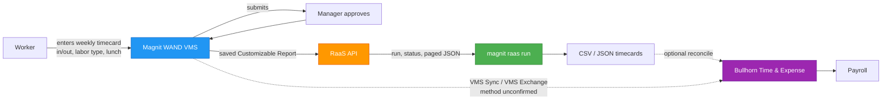

# How Magnit Timecards Reach Us (Simple Version)

Updated: 2026-10-05. Solid lines in the chart are confirmed from Magnit/Bullhorn documentation; dashed lines are unconfirmed. See `PLAN.md` and `TIMECARD_INQUIRY.md`.

## The Big Picture

**Magnit (WAND)** is where timecards are entered and approved. Magnit publishes **no timecard API**. The way to get timecards out programmatically is **RaaS** (Reporting as a Service): a saved Customizable Report that you request and download as JSON. `magnit raas` does that. **Bullhorn** gets time on its own path; exactly how is still unconfirmed.

## Visual Flow

## Step-by-Step

| Step | What happens | Where |
|---|---|---|
| **1. Enter** | Worker adds a weekly timecard per engagement: daily lines with time in/out, labor type (Labor, Lunch, multi-rate types), a "No Lunch Break Taken" flag, notes; piece-rate jobs use units per task | WAND (web or mobile) |
| **2. Submit** | Deadline is typically Sunday 11:59pm PT (some programs Saturday); each saved line gets a `Billing Line #` | WAND |
| **3. Approve** | Manager is notified and approves | WAND |
| **4. Report** | A Customizable Report with the timecard columns is saved; RaaS is enabled for it | Magnit Platform |
| **5. Pull** | `magnit raas run <report> --all -o csv`: request, wait, download every page | magnit-cli |
| **6. Use** | Reconcile against Bullhorn timesheets (`bh pay-bill timesheet`) or feed payroll | bh-cli / payroll |

## Key Things to Know

- **No timecard feed** in the Magnit Integration API (v1.1) or the supplier Gateway API. Gateway covers staffing requests, reference data and candidates only.
- **RaaS is separate** from the Integration API: its own host (`api.us.magnitglobal.com`), its own keys (Credential Key, Client Key, Client Secret), valid 90 days. Needs RaaS permission from your Program Representative.
- **Only Customizable Reports** work with RaaS. Renaming a column renames its JSON key. Magnit does not schedule runs; use cron.
- **Bullhorn side is unconfirmed.** Bullhorn Time & Expense "VMS Exchange" imports VMS time as uploaded files or from a monitored inbox (mapping templates for unlisted VMSs). Bullhorn lists "Magnit API" as a VMS Sync portal for jobs. How their Magnit connector gets time is not public.
- **Unverified claims removed:** "Time Source must be `WAND` for the timecard API" and "Timecards sync in real time" have no source we could find, so they are now questions in `TIMECARD_INQUIRY.md`.
- **NovaTime is unrelated** to Magnit; it is a separate time-clock vendor.

## The Tech Stuff

| Piece | What it is |
|---|---|
| **RaaS** | Token POST (JSON keys) → report POST (`runid`) → status GET (`Completed`) → paged GET (`page`, `size` up to 20000) |
| **Magnit Integration API** | Async feeds (workers, requests, cost centers, ...), OAuth password grant, 24h correlation IDs; secondary for this project |
| **Bullhorn VMS Sync / VMS Exchange** | Bullhorn's bridge for VMS jobs and time files |
| **Worker outbound `billingItems`** | Per-worker billing lines (hours, rates, bill status) in the XSD; unverified |

## Need Help?

- **RaaS permission, timecard report, other time feeds:** your Magnit Program Representative
- **How time reaches Bullhorn:** Bullhorn VMS Support
